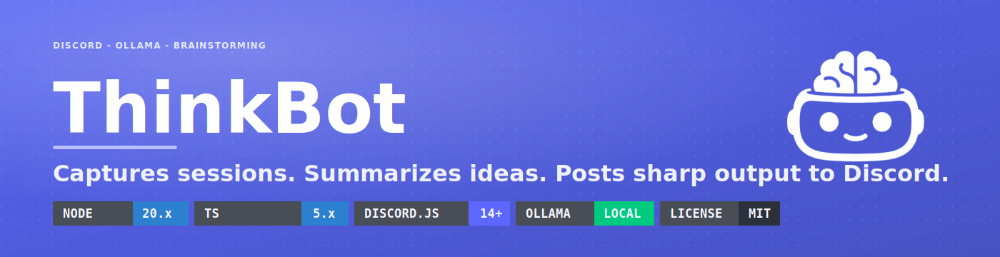

<div align="center">
  
</div>

# Brainstorming Discord Bot

Discord bot for project brainstorming sessions with:
- Multi-project management
- Project-based activation
- Per-project session capture
- On-demand session summaries
- Per-project memory across sessions
- Optional repository metadata linking

This bot is scoped as a brainstorming analyzer, not a coding agent.

## Commands

- `/project create name guided-setup`
- `/project list`
- `/project select project` (exact name)
- `/project exit`
- `/project brain`
- `/project memory`
- `/session summarize`
- `/attach-repo url`
- `/forget-project project` (exact name)
- `/forget-all-projects confirm:true`

## Main flow

1. Create or select a project.
2. Once a project is active, ThinkBot can capture project-relevant chat in that scope when message content intent is enabled.
3. Use `/session summarize` any time you want a structured summary of the recent discussion.
4. Use `/project exit` to leave the current project and stop project-aware behavior.

If no project is active, the bot stays passive outside explicit commands.

## Guided project setup

`/project create` now starts with two inline fields:
- `name`
- `guided-setup` (`true` or `false`)

If `guided-setup` is `true`, ThinkBot opens the guided setup questions.
If `guided-setup` is `false`, it creates the project immediately and makes it active.

The flow collects:
- project name
- GitHub repo URL (optional)
- project description
- main goal
- existing ideas
- constraints
- tech stack under consideration
- prior decisions
- extra notes

You can leave fields blank. ThinkBot will suggest reasonable values for skipped fields, clearly mark them as suggestions, and let you:
- save with suggestions
- save without suggestions
- edit your answers before saving

Saved projects now keep a structured project brain with source metadata so later features can distinguish direct user input from AI-suggested setup fields.

## Quick start

1. Install deps:
```bash
npm install
```

2. Configure env:
```bash
copy .env.example .env
```
Fill in `DISCORD_TOKEN` and `DISCORD_CLIENT_ID`.

For local AI analysis with Ollama (default):
```bash
OLLAMA_MODEL=qwen3:8b
OLLAMA_BASE_URL=http://127.0.0.1:11434
ANALYZER_PROVIDER=ollama
OLLAMA_TIMEOUT_MS=180000
```
Use `OLLAMA_TIMEOUT_MS=180000` (3 minutes) for slower local models to avoid 60-second aborts.

For Docker/VM networking, set:
```bash
OLLAMA_BASE_URL=http://host.docker.internal:11434
```

If you need to force the old rule-based analyzer:
```bash
ANALYZER_PROVIDER=heuristic
```

If you want the bot to capture regular channel messages during sessions, set:
```bash
ENABLE_MESSAGE_CONTENT_INTENT=true
```
and enable **Message Content Intent** in the Discord Developer Portal:
`Bot -> Privileged Gateway Intents -> Message Content Intent`.

3. Register slash commands:
```bash
npm run register:commands
```

4. Run bot:
```bash
npm run dev
```

## Ollama setup notes

1. Start Ollama normally (desktop app/service). Do not run `ollama serve` twice.
2. Verify the API is reachable:
```powershell
curl http://127.0.0.1:11434/api/tags
```
3. Set `OLLAMA_MODEL` to the exact value shown by `ollama list`.
4. Keep `OLLAMA_BASE_URL` at `http://127.0.0.1:11434` unless the bot runs in Docker/VM, then use `http://host.docker.internal:11434`.

On startup, the bot checks `GET /api/tags`. If Ollama is unreachable or the configured model is missing, it logs a clear warning and falls back to the heuristic analyzer instead of crashing.

## Development

- Tests:
```bash
npm test
```

- Live local-model connectivity test (optional):
```powershell
$env:RUN_OLLAMA_LIVE='true'
$env:OLLAMA_BASE_URL='http://127.0.0.1:11434'
$env:OLLAMA_MODEL='qwen3:8b'
npm run test:ollama-live
```

- Typecheck/build:
```bash
npm run build
```

## Common errors

- `Used disallowed intents`
  - Cause: `Message Content Intent` is requested but not enabled for your bot in Discord settings.
  - Fix option A: enable it in the Discord portal and set `ENABLE_MESSAGE_CONTENT_INTENT=true`.
  - Fix option B: keep `ENABLE_MESSAGE_CONTENT_INTENT=false` (bot starts, but it will not ingest normal message content for active projects).

- `UNABLE_TO_VERIFY_LEAF_SIGNATURE`
  - Cause: TLS interception (for example Norton SSL/TLS scanning) and Node does not trust that local root CA by default.
  - Fix: export the local root CA as PEM and set `NODE_EXTRA_CA_CERTS` in `.env`.
